# Vega

**Fault-tolerant AI agent orchestration for Go.**

Vega makes it easy to build reliable AI agent systems with Erlang-style supervision. Use the YAML DSL for rapid prototyping or the Go library for full control.

## Chat

The fastest way to use Vega is the built-in chat interface. Responses stream token-by-token, and tool calls appear inline as collapsible panels with arguments, results, and execution time.

```bash
vega serve team.vega.yaml
# Open http://localhost:3001 → pick an agent → start chatting
```

No YAML file? `vega serve` starts with a default assistant.

### Streaming API

Chat is also available as an SSE endpoint for programmatic use:

```bash
curl -N -X POST localhost:3001/api/agents/assistant/chat/stream \
  -H 'Content-Type: application/json' \
  -d '{"message": "Search for recent Go releases"}'
```

```
event: text_delta
data: {"type":"text_delta","delta":"Let me "}

event: tool_start
data: {"type":"tool_start","tool_call_id":"tc_1","tool_name":"web_search","arguments":{"query":"Go releases 2026"}}

event: tool_end
data: {"type":"tool_end","tool_call_id":"tc_1","tool_name":"web_search","result":"Found 3 results...","duration_ms":1250}

event: text_delta
data: {"type":"text_delta","delta":"Based on the results..."}

event: done
data: {"type":"done"}
```

| Event | Fields | Description |
|-------|--------|-------------|
| `text_delta` | `delta` | Incremental text content |
| `tool_start` | `tool_call_id`, `tool_name`, `arguments` | Tool execution began |
| `tool_end` | `tool_call_id`, `tool_name`, `result`, `duration_ms` | Tool execution finished |
| `error` | `error` | An error occurred |
| `done` | | Stream complete |

A blocking (non-streaming) endpoint is also available at `POST /api/agents/{name}/chat`.

### Go Library

```go
stream, _ := proc.SendStreamRich(ctx, "Search for recent Go releases")
for event := range stream.Events() {
    switch event.Type {
    case vega.ChatEventTextDelta:
        fmt.Print(event.Delta)
    case vega.ChatEventToolStart:
        fmt.Printf("\n[calling %s]\n", event.ToolName)
    case vega.ChatEventToolEnd:
        fmt.Printf("[done in %dms]\n", event.DurationMs)
    }
}
```

Use `SendStream` for simple text-only streaming, or `Send` for a blocking call.

---

## Installation

### CLI Tool

```bash
# Homebrew (macOS / Linux)
brew install everydev1618/tap/vega

# Go install
go install github.com/everydev1618/govega/cmd/vega@latest

# Or download a binary from GitHub Releases
# https://github.com/everydev1618/govega/releases
```

### Go Library

```bash
go get github.com/everydev1618/govega
```

### Configuration

Set your Anthropic API key:

```bash
export ANTHROPIC_API_KEY=your-key-here
```

---

## Quick Start

### Option 1: Go Library

```go
package main

import (
    "context"
    "fmt"
    "log"

    "github.com/martellcode/vega"
    "github.com/martellcode/vega/llm"
)

func main() {
    // Create LLM backend
    anthropic := llm.NewAnthropic()

    // Create orchestrator
    orch := vega.NewOrchestrator(vega.WithLLM(anthropic))

    // Define an agent
    agent := vega.Agent{
        Name:   "assistant",
        Model:  "claude-sonnet-4-20250514",
        System: vega.StaticPrompt("You are a helpful coding assistant."),
    }

    // Spawn a process
    proc, err := orch.Spawn(agent)
    if err != nil {
        log.Fatal(err)
    }

    // Send a message
    ctx := context.Background()
    response, err := proc.Send(ctx, "Write a hello world function in Go")
    if err != nil {
        proc.Fail(err)  // Mark process as failed
        log.Fatal(err)
    }

    // IMPORTANT: Always mark processes as completed when done
    proc.Complete(response)

    fmt.Println(response)

    // Cleanup
    orch.Shutdown(ctx)
}
```

### Option 2: YAML DSL

Create `assistant.vega.yaml`:

```yaml
name: Assistant

agents:
  helper:
    model: claude-sonnet-4-20250514
    system: You are a helpful assistant.
```

Run interactively:

```bash
vega repl assistant.vega.yaml
> /ask helper
> What is the capital of France?
```

---

## ⚠️ Important: Process Lifecycle

**Every spawned process must be completed or failed.** This is the most common mistake when using Vega.

```go
// ❌ WRONG - process leaks, stays "running" forever
proc, _ := orch.Spawn(agent)
proc.SendAsync(task)
return "Started!"

// ✅ CORRECT - process properly completed
proc, _ := orch.Spawn(agent)
response, err := proc.Send(ctx, task)
if err != nil {
    proc.Fail(err)
    return err
}
proc.Complete(response)
```

See [Best Practices](docs/BEST_PRACTICES.md) for more details.

---

## Architecture

```mermaid
flowchart LR
    subgraph Lifecycle["Process Lifecycle"]
        Pending["🟡 Pending"]
        Running["🟢 Running"]
        Completed["✅ Completed"]
        Failed["❌ Failed"]
        Timeout["⏱️ Timeout"]

        Pending --> Running
        Running --> Completed
        Running --> Failed
        Running --> Timeout
        Failed -->|"restart"| Pending
    end
```





---

## Features

### Erlang-Style Supervision

Processes automatically restart on failure with configurable strategies:

```go
proc, err := orch.Spawn(agent, vega.WithSupervision(vega.Supervision{
    Strategy:    vega.Restart,  // Restart, Stop, or Escalate
    MaxRestarts: 3,
    Window:      5 * time.Minute,
    Backoff: vega.BackoffConfig{
        Initial:    100 * time.Millisecond,
        Multiplier: 2.0,
        Max:        30 * time.Second,
    },
}))
```

Or in YAML:

```yaml
agents:
  worker:
    model: claude-sonnet-4-20250514
    system: You process tasks reliably.
    supervision:
      strategy: restart
      max_restarts: 3
      window: 5m
```

### Tools

Register tools for agents to use:

```go
tools := vega.NewTools()
tools.RegisterBuiltins() // read_file, write_file, run_command

// Register custom tool
tools.Register("greet", func(name string) string {
    return "Hello, " + name + "!"
})

agent := vega.Agent{
    Name:  "greeter",
    Tools: tools,
}
```

Or define in YAML with full HTTP support:

```yaml
tools:
  fetch_weather:
    description: Get weather for a city
    params:
      - name: city
        type: string
        required: true
    implementation:
      type: http
      method: GET
      url: "https://api.weather.com/v1/current?city={{.city}}"
      headers:
        Authorization: "Bearer {{.api_key}}"
      timeout: 10s

  create_issue:
    description: Create a GitHub issue
    params:
      - name: title
        type: string
        required: true
      - name: body
        type: string
        required: true
    implementation:
      type: http
      method: POST
      url: "https://api.github.com/repos/{{.owner}}/{{.repo}}/issues"
      headers:
        Authorization: "token {{.token}}"
        Content-Type: application/json
      body:
        title: "{{.title}}"
        body: "{{.body}}"
      timeout: 30s

  run_script:
    description: Execute a shell script
    params:
      - name: script
        type: string
        required: true
    implementation:
      type: exec
      command: "bash -c '{{.script}}'"
      timeout: 60s
```

Tool implementations support `{{.param}}` template interpolation for dynamic values.

### Streaming Responses

See the [Chat](#chat) section at the top for `SendStreamRich` (structured events with tool visibility).

For simple text-only streaming:

```go
stream, err := proc.SendStream(ctx, "Tell me a story")
if err != nil {
    log.Fatal(err)
}

for chunk := range stream.Chunks() {
    fmt.Print(chunk)
}
fmt.Println()
```

### Async Operations

```go
// Fire and forget
future := proc.SendAsync("Process this in background")

// Do other work...

// Wait for result
response, err := future.Await(ctx)
```

### Parallel Execution (DSL)

```yaml
steps:
  - parallel:
      - agent1:
          send: "Task 1"
          save: result1
      - agent2:
          send: "Task 2"
          save: result2
  - combiner:
      send: "Combine: {{result1}} and {{result2}}"
```

### Rate Limiting & Circuit Breakers

```go
orch := vega.NewOrchestrator(
    vega.WithLLM(anthropic),
    vega.WithRateLimits(map[string]vega.RateLimitConfig{
        "claude-sonnet-4-20250514": {
            RequestsPerMinute: 60,
            TokensPerMinute:   100000,
        },
    }),
)

agent := vega.Agent{
    CircuitBreaker: &vega.CircuitBreaker{
        Threshold:  5,           // Open after 5 failures
        ResetAfter: time.Minute, // Try again after 1 minute
    },
}
```

### Intelligent Retry with Error Classification

Vega automatically classifies errors and retries appropriately:

```go
agent := vega.Agent{
    Name: "resilient-worker",
    Retry: &vega.RetryPolicy{
        MaxAttempts: 5,
        Backoff: vega.BackoffConfig{
            Initial:    100 * time.Millisecond,
            Multiplier: 2.0,
            Max:        30 * time.Second,
            Jitter:     0.1, // ±10% randomness
            Type:       vega.BackoffExponential,
        },
        RetryOn: []vega.ErrorClass{
            vega.ErrClassRateLimit,
            vega.ErrClassOverloaded,
            vega.ErrClassTimeout,
            vega.ErrClassTemporary,
        },
    },
}
```

Error classes are automatically detected:
- `ErrClassRateLimit` - 429 errors, "rate limit" messages
- `ErrClassOverloaded` - 503 errors, capacity issues
- `ErrClassTimeout` - Deadline exceeded, connection timeouts
- `ErrClassTemporary` - Transient server errors (5xx)
- `ErrClassAuthentication` - 401/403 errors (not retried)
- `ErrClassInvalidRequest` - 400 errors (not retried)
- `ErrClassBudgetExceeded` - Cost limits (not retried)

### Configurable Iteration Limits

Control how many tool call loops an agent can perform:

```go
agent := vega.Agent{
    Name:          "deep-researcher",
    MaxIterations: 100, // Default is 50
}
```

### Conversation History

Vega provides flexible ways to manage conversation context across sessions.

#### Resume Conversations with `WithMessages`

Spawn a process with pre-existing conversation history:

```go
// Load previous conversation (from database, file, etc.)
history := []vega.Message{
    {Role: vega.RoleUser, Content: "What's our project deadline?"},
    {Role: vega.RoleAssistant, Content: "The deadline is March 15th."},
}

// Spawn with existing history - the agent remembers the conversation
proc, err := orch.Spawn(agent, vega.WithMessages(history))
if err != nil {
    log.Fatal(err)
}

// Continue the conversation naturally
response, _ := proc.Send(ctx, "Can we extend it by a week?")
// Agent knows "it" refers to the March 15th deadline
```

#### Serialize Messages for Persistence

Save and restore conversations using JSON:

```go
// Save conversation to database/file
messages := []vega.Message{
    {Role: vega.RoleUser, Content: "Hello"},
    {Role: vega.RoleAssistant, Content: "Hi there!"},
}
data, err := vega.MarshalMessages(messages)
// Store `data` in your database

// Later, restore the conversation
restored, err := vega.UnmarshalMessages(data)
proc, err := orch.Spawn(agent, vega.WithMessages(restored))
```

#### Token-Aware Context with `TokenBudgetContext`

Automatically manage context within a token budget:

```go
// Create context with 8000 token budget (~32k chars)
ctx := vega.NewTokenBudgetContext(8000)

// Optionally load existing history
ctx.Load(previousMessages)

agent := vega.Agent{
    Name:    "assistant",
    Context: ctx, // Attach to agent
}

// As conversation grows, oldest messages are automatically trimmed
// to stay within the 8000 token budget

// Save for later
snapshot := ctx.Snapshot()
data, _ := vega.MarshalMessages(snapshot)
```

`TokenBudgetContext` features:
- Automatic trimming of oldest messages when budget exceeded
- Token estimation (~4 chars per token)
- `Load()` to restore from persistence
- `Snapshot()` to get messages for saving
- Thread-safe for concurrent use

### Context Auto-Compaction

For smarter context management with LLM-powered summarization:

```go
// Create a sliding window context that keeps recent messages
// and summarizes older ones
ctx := vega.NewSlidingWindowContext(20) // Keep last 20 messages

agent := vega.Agent{
    Name:    "long-conversation-agent",
    Context: ctx,
}

// Check if compaction is needed
if ctx.NeedsCompaction(50000) { // 50k token threshold
    err := ctx.Compact(llm) // Uses LLM to summarize old messages
}
```

The `SlidingWindowContext` automatically:
- Keeps a configurable number of recent messages
- Can summarize older messages using the LLM
- Preserves important context while reducing token usage

**When to use which:**
| Context Manager | Best For |
|-----------------|----------|
| `WithMessages` only | Simple resume, short conversations |
| `TokenBudgetContext` | Long conversations, automatic trimming, persistence |
| `SlidingWindowContext` | Very long conversations needing intelligent summarization |

### Budget Control

```go
agent := vega.Agent{
    Budget: &vega.Budget{
        Limit:    5.0,           // $5.00 max
        OnExceed: vega.BudgetBlock,
    },
}
```

### Spawn Tree Tracking

Track parent-child relationships when agents spawn other agents:

```go
// When spawning from a parent process, use WithParent to establish the relationship
childProc, err := orch.Spawn(childAgent,
    vega.WithParent(parentProc),           // Track parent-child relationship
    vega.WithSpawnReason("Process data"),  // Optional context for the spawn
)

// The child process will have:
// - ParentID: parent's process ID
// - ParentAgent: parent's agent name
// - SpawnDepth: parent's depth + 1

// Query the entire spawn tree
tree := orch.GetSpawnTree()
// Returns []*SpawnTreeNode with hierarchical structure
```

For tools that spawn processes, the parent process is automatically available via context:

```go
func mySpawnTool(ctx context.Context, params map[string]any) (string, error) {
    // Get the calling process from context
    parent := vega.ProcessFromContext(ctx)

    // Spawn with parent tracking
    child, err := orch.Spawn(agent,
        vega.WithParent(parent),
        vega.WithSpawnReason(params["task"].(string)),
    )
    // ...
}
```

The spawn tree structure:

```go
type SpawnTreeNode struct {
    ProcessID   string           `json:"process_id"`
    AgentName   string           `json:"agent_name"`
    Task        string           `json:"task"`
    Status      Status           `json:"status"`
    SpawnDepth  int              `json:"spawn_depth"`
    SpawnReason string           `json:"spawn_reason,omitempty"`
    StartedAt   time.Time        `json:"started_at"`
    Children    []*SpawnTreeNode `json:"children,omitempty"`
}
```

### MCP (Model Context Protocol) Servers

Connect to MCP servers to use external tools:

```go
import "github.com/martellcode/vega/mcp"

tools := vega.NewTools(
    vega.WithMCPServer(mcp.ServerConfig{
        Name:    "filesystem",
        Command: "npx",
        Args:    []string{"-y", "@modelcontextprotocol/server-filesystem", "/workspace"},
    }),
    vega.WithMCPServer(mcp.ServerConfig{
        Name:    "github",
        Command: "npx",
        Args:    []string{"-y", "@modelcontextprotocol/server-github"},
        Env:     map[string]string{"GITHUB_TOKEN": os.Getenv("GITHUB_TOKEN")},
    }),
)

// Connect to all MCP servers
ctx := context.Background()
if err := tools.ConnectMCP(ctx); err != nil {
    log.Fatal(err)
}
defer tools.DisconnectMCP()

// Tools are automatically registered with prefix: servername__toolname
// e.g., "filesystem__read_file", "github__create_issue"
```

Or in YAML:

```yaml
settings:
  mcp:
    servers:
      - name: filesystem
        transport: stdio
        command: npx
        args: ["-y", "@modelcontextprotocol/server-filesystem", "/workspace"]
      - name: github
        command: npx
        args: ["-y", "@modelcontextprotocol/server-github"]
        env:
          GITHUB_TOKEN: "${GITHUB_TOKEN}"
        timeout: 30s

agents:
  coder:
    model: claude-sonnet-4-20250514
    system: You are a coding assistant.
    tools:
      - filesystem__*   # All tools from filesystem server
      - github__create_issue
```

### Web Dashboard & REST API

Monitor and control your agents through a browser-based dashboard:

```bash
vega serve team.vega.yaml
# Open http://localhost:3001
```

The dashboard provides:
- **Chat** — Real-time streaming chat with inline tool call panels (see top of README)
- **Overview** — Live stats, recent events, active processes
- **Process Explorer** — Sortable process list with conversation history
- **Spawn Tree** — Hierarchical view of parent-child process relationships
- **Event Stream** — Real-time SSE feed with filtering
- **Agent Registry** — Agent definitions from your `.vega.yaml`
- **MCP Servers** — Connection status and available tools
- **Workflow Launcher** — Run workflows from the browser with auto-generated input forms
- **Cost Dashboard** — Per-agent and per-process cost tracking

**REST API** — All data is also available via JSON endpoints:

```bash
curl localhost:3001/api/processes    # List processes
curl localhost:3001/api/agents       # List agents
curl localhost:3001/api/stats        # Aggregate metrics
curl localhost:3001/api/spawn-tree   # Spawn tree
curl localhost:3001/api/workflows    # List workflows
curl localhost:3001/api/mcp/servers  # MCP server status
curl localhost:3001/api/events       # SSE event stream

# Launch a workflow
curl -X POST localhost:3001/api/workflows/review/run \
  -H 'Content-Type: application/json' \
  -d '{"task": "Write a sort function"}'

# Chat (see Streaming API section at top of README)
curl -X POST localhost:3001/api/agents/assistant/chat \
  -H 'Content-Type: application/json' \
  -d '{"message": "Hello!"}'
```

**Flags:**
- `--addr :3001` — HTTP listen address (default `:3001`)
- `--db .vega-serve.db` — SQLite database path for persistent history

Historical process data, events, and workflow runs persist across restarts via SQLite.

### Agent Skills

Skills provide dynamic prompt injection based on message context:

```go
import "github.com/martellcode/vega/skills"

// Load skills from directories
loader := skills.NewLoader("./skills", "~/.vega/skills")
loader.Load(ctx)

// Wrap system prompt with skills
agent := vega.Agent{
    Name:   "assistant",
    Model:  "claude-sonnet-4-20250514",
    System: vega.NewSkillsPrompt(
        vega.StaticPrompt("You are a helpful assistant."),
        loader,
        vega.WithMaxActiveSkills(3),
    ),
}
```

Create skill files (`skills/code-review.skill.md`):

```markdown
---
name: code-review
description: Expert code review guidance
tags: [code, review]
triggers:
  - type: keyword
    keywords: [review, PR, pull request, code review]
  - type: pattern
    pattern: "review (this|my) (code|changes)"
---

# Code Review Expert

When reviewing code, focus on:
1. Security vulnerabilities
2. Performance issues
3. Code clarity and maintainability
4. Test coverage
```

Or configure in YAML:

```yaml
settings:
  skills:
    directories:
      - ./skills
      - ~/.vega/skills

agents:
  reviewer:
    model: claude-sonnet-4-20250514
    system: You are a code reviewer.
    skills:
      include: [code-review, security-*]
      exclude: [deprecated-*]
      max_active: 3
```

Skills are automatically matched and injected based on:
- **keyword**: Message contains specific words
- **pattern**: Message matches a regex pattern
- **always**: Always included

---

## CLI Commands

```bash
# Run a workflow
vega run team.vega.yaml --workflow my-workflow --task "Do something"

# Validate a file
vega validate team.vega.yaml --verbose

# Interactive REPL
vega repl team.vega.yaml

# Web dashboard & REST API
vega serve team.vega.yaml
vega serve team.vega.yaml --addr :8080 --db my-data.db

# Show help
vega help
```

---

## Examples

The `examples/` directory contains complete working examples:

| Example | Description |
|---------|-------------|
| [`simple-agent.vega.yaml`](examples/simple-agent.vega.yaml) | Basic single-agent chatbot |
| [`code-review.vega.yaml`](examples/code-review.vega.yaml) | Two-agent code review workflow |
| [`dev-team.vega.yaml`](examples/dev-team.vega.yaml) | Full dev team (architect, frontend, backend, reviewer, PM) |
| [`tools-demo.vega.yaml`](examples/tools-demo.vega.yaml) | Custom HTTP and exec tools |
| [`mcp-demo.vega.yaml`](examples/mcp-demo.vega.yaml) | MCP server integration |
| [`skills-demo.vega.yaml`](examples/skills-demo.vega.yaml) | Dynamic skill injection |
| [`supervision-demo.vega.yaml`](examples/supervision-demo.vega.yaml) | Fault tolerance patterns |
| [`control-flow.vega.yaml`](examples/control-flow.vega.yaml) | Conditionals, loops, parallel execution |

Run an example:

```bash
vega run examples/code-review.vega.yaml --workflow review --task "Write a binary search function"
```

---

## DSL Reference

### Settings

```yaml
settings:
  default_model: claude-sonnet-4-20250514
  sandbox: ./workspace              # Restrict file operations
  budget: "$100.00"                 # Global budget limit

  mcp:                              # MCP server configuration
    servers:
      - name: filesystem
        transport: stdio            # stdio (default), http, sse
        command: npx
        args: ["-y", "@modelcontextprotocol/server-filesystem", "/workspace"]
        env:
          DEBUG: "true"
        timeout: 30s

  skills:                           # Global skill directories
    directories:
      - ./skills
      - ~/.vega/skills

  rate_limit:
    requests_per_minute: 60
    tokens_per_minute: 100000
```

### Agents

```yaml
agents:
  agent-name:
    model: claude-sonnet-4-20250514    # Required
    system: |                           # Required
      Your system prompt here.
    temperature: 0.7                    # Optional (0.0-1.0)
    tools:                              # Optional
      - read_file
      - write_file
      - filesystem__*                   # MCP tools (server__pattern)
    budget: "$5.00"                     # Optional
    supervision:                        # Optional
      strategy: restart
      max_restarts: 3
    skills:                             # Optional skill configuration
      directories:                      # Agent-specific skill dirs
        - ./agent-skills
      include: [coding-*, review]       # Only these skills
      exclude: [deprecated-*]           # Never these skills
      max_active: 3                     # Max skills to inject
```

### Workflows

```yaml
workflows:
  workflow-name:
    description: What this workflow does
    inputs:
      task:
        type: string
        required: true
        default: "default value"
    steps:
      - agent-name:
          send: "Message with {{task}} interpolation"
          save: variable_name
          timeout: 30s
    output: "{{variable_name}}"
```

### Control Flow

```yaml
# Conditionals
- if: "{{approved}}"
  then:
    - agent: ...
  else:
    - agent: ...

# Loops
- for: item in items
  steps:
    - agent:
        send: "Process {{item}}"

# Parallel
- parallel:
    - agent1: ...
    - agent2: ...

# Try/Catch
- try:
    - risky-agent: ...
  catch:
    - fallback-agent: ...
```

### Expression Filters

```yaml
{{name | upper}}           # UPPERCASE
{{name | lower}}           # lowercase
{{name | trim}}            # Remove whitespace
{{name | default:anon}}    # Default value
{{text | truncate:100}}    # Limit length
{{items | join:, }}        # Join array
```

---

## Documentation

| Document | Description |
|----------|-------------|
| [Quick Start](docs/QUICKSTART.md) | Get running in 5 minutes |
| [**Best Practices**](docs/BEST_PRACTICES.md) | **Common pitfalls and how to avoid them** |
| [DSL Reference](docs/DSL.md) | Complete YAML syntax |
| [Go Library Spec](docs/SPEC.md) | Full API reference |
| [Tools](docs/TOOLS.md) | Built-in and custom tools |
| [MCP Servers](docs/MCP.md) | Model Context Protocol integration |
| [Skills](docs/SKILLS.md) | Dynamic prompt injection |
| [Supervision](docs/SUPERVISION.md) | Fault tolerance patterns |
| [Architecture](docs/ARCHITECTURE.md) | Internal design |
| [Web Dashboard](docs/SERVE.md) | `vega serve` dashboard & REST API |

---

### Structured Logging

Vega uses Go's `slog` for structured logging. Enable debug logging to see detailed information:

```go
import "log/slog"

// Enable debug logging
slog.SetLogLoggerLevel(slog.LevelDebug)
```

Log events include:
- Process spawn/complete/fail with agent names and IDs
- LLM call success/failure with latency, tokens, and error classification
- Retry attempts with backoff delays
- MCP server stderr output

### Default Configuration

Vega provides sensible defaults that can be overridden:

```go
// Default constants (defined in agent.go)
const (
    DefaultMaxIterations        = 50        // Tool call loop limit
    DefaultMaxContextTokens     = 100000    // Context window size
    DefaultLLMTimeout           = 5 * time.Minute
    DefaultStreamBufferSize     = 100
    DefaultSupervisorPollInterval = 100 * time.Millisecond
)

// Anthropic defaults (defined in llm/anthropic.go)
const (
    DefaultAnthropicTimeout = 5 * time.Minute
    DefaultAnthropicModel   = "claude-sonnet-4-20250514"
    DefaultAnthropicBaseURL = "https://api.anthropic.com"
)
```

---

## Why Vega?

### Erlang-Inspired Process Model

Most agent frameworks treat LLM calls as stateless functions. Vega models agents as **processes** with a full lifecycle (`pending → running → completed/failed/timeout`), managed by an **Orchestrator**. The key concepts ported from Erlang/OTP:

- **Process Linking** — Bidirectional links between processes. If one dies, the linked one dies too (unless it traps exits). This is how you build robust agent topologies where dependent agents fail together.
- **Monitors** — Unidirectional observation: watch another process and get notified when it exits, without dying yourself.
- **TrapExit** — A process can opt to receive exit signals as messages instead of dying. This is exactly how supervisors survive their children crashing.
- **Supervision Trees** — Strategies (`Restart`, `Stop`, `Escalate`, `RestartAll`) with configurable backoff (exponential, linear, constant with jitter) and windowed restart counting.

Just as Erlang/OTP made it possible to build telecom-grade systems by making processes and supervision cheap and composable, Vega applies the same philosophy to AI agent systems that need to run in production without falling over.

### Agent = Blueprint, Process = Running Instance

The separation of `Agent` (a struct defining model, tools, system prompt, budget) from `Process` (a running instance with state, messages, metrics) means you can spawn multiple processes from the same agent definition, each with its own conversation history and lifecycle. This is the actor model applied to LLMs.

### Intelligent Error Classification

Errors are automatically classified into 7 categories (`RateLimit`, `Overloaded`, `Timeout`, `Temporary`, `InvalidRequest`, `Authentication`, `BudgetExceeded`) with smart retry decisions. Rate limits and overloaded errors get retried with backoff; auth errors and bad requests don't. Production-grade reliability is built into the framework, not bolted on.

### Team Delegation with Shared Blackboard

Agents can delegate to team members via a `delegate` tool with context-aware message enrichment — recent conversation history is forwarded so delegates understand the full picture. A **shared blackboard** (`bb_read`, `bb_write`, `bb_list`) gives team members structured shared state, not just text passed back and forth.

### Dual Interface: Go Library + YAML DSL

The Go library gives full programmatic control, while the YAML DSL lets non-programmers define multi-agent workflows with control flow (`if/then/else`, `for-each`, `parallel`, `try/catch`), variable interpolation, and expression filters. The DSL interpreter is a proper workflow engine — not a thin config wrapper.

### Everything is Observable

Built-in web dashboard with SSE streaming, process explorer, spawn tree visualization, cost tracking, and a chat UI with inline tool call panels. Processes emit structured events (`text_delta`, `tool_start`, `tool_end`), and the `ChatStream` API makes it straightforward to build rich streaming interfaces.

### Feature Comparison

| Feature | Raw SDK | Other Frameworks | Vega |
|---------|---------|------------------|------|
| Supervision trees | Manual | ❌ | ✅ Built-in |
| Process linking & monitors | ❌ | ❌ | ✅ Erlang-style |
| Automatic retries | Manual | Partial | ✅ Smart (error-classified) |
| Rate limiting | Manual | Manual | ✅ Built-in |
| Cost tracking | Manual | Partial | ✅ Built-in |
| MCP server support | Manual | Partial | ✅ Built-in |
| Web dashboard | ❌ | ❌ | ✅ Built-in |
| Team delegation & blackboard | ❌ | ❌ | ✅ Built-in |
| Dynamic skills | ❌ | ❌ | ✅ Built-in |
| Conversation history | Manual | Manual | ✅ WithMessages, persistence helpers |
| Context compaction | ❌ | ❌ | ✅ Auto-summarization |
| Structured logging | Manual | Partial | ✅ slog integration |
| Error classification | ❌ | ❌ | ✅ 7 error classes |
| Non-programmer friendly | ❌ | ❌ | ✅ YAML DSL |
| Parallel execution | Complex | Complex | ✅ `parallel:` |
| Config-driven | ❌ | Limited | ✅ Full YAML |

---

## Project Structure

```
vega/
├── agent.go           # Agent definition, context managers, defaults
├── context.go         # TokenBudgetContext, message serialization
├── process.go         # Running process with lifecycle, retry logic, spawn tree tracking
├── orchestrator.go    # Process management, spawn options, groups
├── supervision.go     # Fault tolerance, health monitoring
├── tools.go           # Tool registration, HTTP/exec executors
├── mcp_tools.go       # MCP server integration
├── skills.go          # Skills prompt wrapper
├── llm.go             # LLM interface, cost calculation
├── errors.go          # Error types, classification, retry decisions
├── llm/
│   └── anthropic.go   # Anthropic backend with streaming
├── mcp/               # Model Context Protocol client
│   ├── types.go       # MCP types and JSON-RPC
│   ├── client.go      # MCP client implementation
│   ├── transport_stdio.go  # Subprocess transport with logging
│   └── transport_http.go   # HTTP/SSE transport
├── skills/            # Agent skills system
│   ├── types.go       # Skill and trigger types
│   ├── parser.go      # SKILL.md file parser
│   ├── loader.go      # Directory scanner
│   └── matcher.go     # Keyword/pattern matching
├── container/         # Docker container management
│   ├── manager.go     # Container lifecycle
│   └── project.go     # Project isolation
├── serve/             # Web dashboard & REST API
│   ├── server.go      # HTTP server, routes, CORS
│   ├── handlers_api.go    # REST endpoint handlers
│   ├── handlers_sse.go    # Server-Sent Events stream
│   ├── broker.go      # Event pub/sub for SSE
│   ├── store.go       # Persistence interface
│   ├── store_sqlite.go    # SQLite implementation
│   ├── types.go       # API request/response types
│   ├── embed.go       # Embedded SPA frontend
│   └── frontend/      # React + Vite + Tailwind dashboard
├── dsl/
│   ├── types.go       # AST types
│   ├── parser.go      # YAML parser
│   └── interpreter.go # Workflow execution
├── cmd/vega/
│   ├── main.go        # CLI entry point
│   └── serve.go       # serve command
├── examples/          # Example .vega.yaml files
└── docs/              # Documentation
```

---

## Contributing

Contributions welcome! Please read the code, write tests, and submit PRs.

```bash
# Run tests
go test ./...

# Build CLI
go build -o vega ./cmd/vega
```

---

## License

MIT
