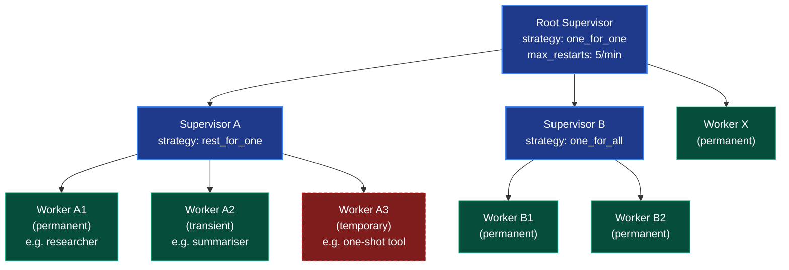
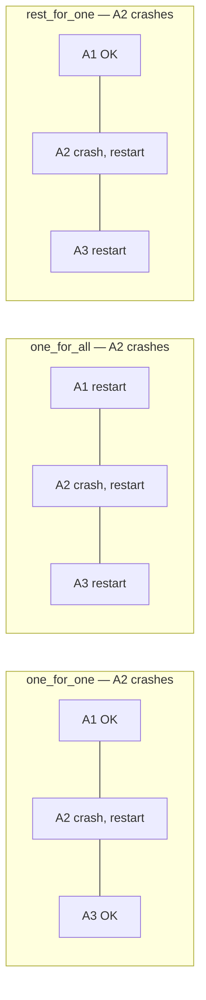
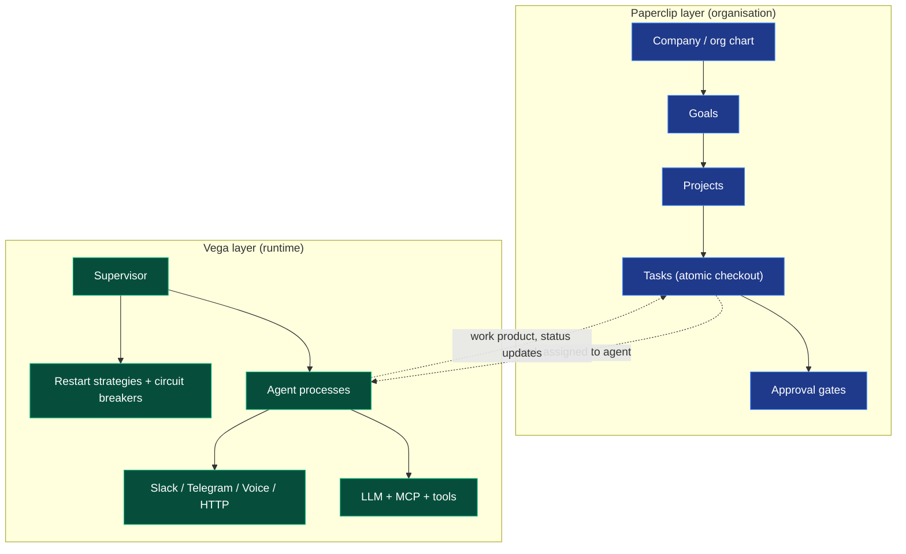

# Vega's Approach to Agent Orchestration

A non-technical explanation of what Vega is, why it works the way it does, and
how it differs from systems like OpenClaw and Hermes-Agent. Written so it can
be lifted into pitch decks, onboarding docs, or explanations for non-engineers.

---

## The one-line pitch

> Vega treats AI agents the way phone networks treat call workers — as
> supervised, restartable processes inside a tree of managers, not as a single
> chat session.

---

## The non-technical version

Imagine a call centre.

- **An "agent" is a job description** — "you handle returns, you speak this
  way, you have these tools, you can spend up to $X." It's a sheet of paper,
  not a person.
- **A "process" is the actual person showing up to do the job.** One job
  description can have ten people running it at once for ten different
  customers. When the shift ends — or when the person breaks down — they go
  home.
- **A "supervisor" is the floor manager.** Their only job is: when a worker
  collapses, decide what to do. Restart just that one? Restart everyone in
  their pod? Give up after the third crash and escalate? Those decisions are
  written down in advance, so no human has to babysit.

This pattern was invented in the 1980s for telephone switches at Ericsson (the
Erlang language / OTP framework). It's why phone networks famously achieve
"nine nines" of uptime — individual components fail constantly, but the system
as a whole keeps going because failure is *expected and planned for*. Vega
borrows the entire mental model and applies it to LLM agents.

The key shift in mindset: **agents will fail** (rate limits, timeouts, bad
tool calls, model overload). Vega builds the failure handling *into the
structure* rather than asking the developer to wrap every call in try/catch.
Three knobs do most of the work:

1. **Restart strategy** — when a child crashes, restart only it, restart all
   its siblings, or restart it plus everything started after it.
2. **Restart policy** — always restart this one; restart only on abnormal
   exit; or never restart.
3. **Backoff & limits** — how long to wait between restarts, and "give up
   after N crashes in M minutes" so a poison pill doesn't restart-loop
   forever.

On top of that base, Vega adds two things you'd expect from a modern agent
framework: a YAML DSL so non-programmers can declare agents, and meta-agents
(**Hera** to create/edit agents at runtime, **Iris** to route a goal to the
right agent).

---

## Erlang supervision — diagrams

How the strategies behave when a child dies:

---

## Graph vs supervision tree

Both are "boxes connected by lines," so the distinction is easy to miss. The
difference isn't the shape — it's **what the lines mean** and **what the
framework does for you when something breaks**.

### A graph (LangGraph, CrewAI flows, AutoGen, n8n, Mastra workflows)

Lines = **data flow / control flow**. "When node A finishes, pass its output
to node B." The graph is a recipe for *how work moves through the system*.

- The framework's job: route messages between nodes and decide who runs next.
- Failure model: if a node throws, the graph either halts, or you wrap that
  node in your own try/catch and decide what to do. There is no built-in
  concept of "this node is allowed to die and someone above it knows how to
  bring it back."
- Identity: nodes are usually **roles in a single run** ("the researcher,"
  "the critic"). When the run ends, they're gone.
- Mental model: a flowchart. A pipeline. A DAG.

If a node dies mid-run, the run dies. You handle reliability by writing
defensive code inside each node.

### A supervision tree (Erlang/OTP, Akka, Vega)

Lines = **responsibility for liveness**. "I am the supervisor of these
children. If one dies, *I* decide what happens — restart it, restart its
siblings, or escalate the death up to my own supervisor."

- The framework's job: keep things *alive* according to declared policy.
  Routing of work is a separate concern.
- Failure model: failure is a first-class signal that propagates *upward*
  through the tree. Each parent has a written-down rule (`one_for_one`,
  `one_for_all`, `rest_for_one`, max-restarts-in-window, backoff) for how to
  react.
- Identity: a tree node is a **long-lived process** with a lifecycle
  independent of any single piece of work. The supervisor itself is also a
  process and can be supervised.
- Mental model: an org chart. The CEO doesn't tell employees what task to do
  next; they make sure the org keeps functioning when individuals quit or
  burn out.

If a child dies, the parent reacts deterministically and the rest of the
system keeps running.

### The crisp version

| | Graph | Supervision tree |
|---|---|---|
| Edges encode | "where data goes next" | "who is responsible if you die" |
| Failure handling | inside each node, ad hoc | declared at the parent, uniform |
| Run lifetime | nodes live for the run | processes outlive any single run |
| Question it answers | "what happens *next*?" | "who picks up the pieces?" |

### Why this matters for agents specifically

LLM calls fail constantly — rate limits, timeouts, overload, malformed tool
args, blown context budgets. In a graph, every node ends up reinventing
retry/backoff/give-up logic locally, and the failure modes leak into the
orchestration code. In a supervision tree, you declare the failure policy
*once* per group of children and the runtime enforces it. The agents
themselves get to be naïve.

A graph and a tree can coexist — Vega still lets you wire agents together to
pass work around. The bet is that the **load-bearing primitive** — the thing
the runtime guarantees about — should be supervision, with data flow layered
on top, rather than the other way around.

> A graph tells the system *what to do*; a supervision tree tells the system
> *how to stay alive while doing it*.

---

## "Processes outlive any single run" — unpacked

In a graph framework, when you press "go" on a workflow, it spins up the
nodes, they pass messages around, the run finishes, and everything is torn
down. The "researcher node" only existed for those 30 seconds. If you run the
same workflow again tomorrow, a *brand new* researcher node is created from
scratch. Nothing about the previous run is still alive — the only thing that
persists is whatever you explicitly wrote to a database.

In a supervision tree, the unit isn't "a node in this run" — it's a
**process** that gets started once and stays alive indefinitely. It sits
there waiting for work. You send it a task, it does it, it goes back to
waiting. You send it another task an hour later, *the same process* handles
it. It only dies if it crashes (and then its supervisor restarts it) or if
you explicitly stop it.

### A concrete example

Picture an agent that monitors your inbox and drafts replies.

**Graph framing:** every time an email arrives, you start a new run. The
"inbox-watcher" node is born, reads the email, drafts a reply, dies. Run
over. New email = new run = new node.

**Supervision-tree framing:** an `InboxWatcher` process is started once, at
boot. It lives forever. Emails arrive, it handles them. If it crashes on a
malformed email, the supervisor restarts it within milliseconds, and it
picks up where it left off. The same process handles email #1 and email
#10,000.

### Why the distinction matters

Because long-lived processes can hold things that runs can't:

- **In-memory state** that doesn't need to be serialised to a database every
  time (rate-limit counters, circuit-breaker state, recent-context caches,
  open connections)
- **A stable identity** — other processes can address it by name
  (`pid("inbox-watcher")`) and send it messages, knowing it'll be there
- **A position in the tree** — its supervisor knows about it, watches it,
  has a restart policy for it
- **Independence from any caller** — nobody is "waiting for the run to
  finish" because there is no run; there's just a process that handles work
  as it arrives

A graph node is a *function call*. A supervision-tree process is more like a
*running service* — closer to a Unix daemon or a microservice than to a
workflow step.

> A graph node is a verb; a supervised process is a noun.

---

## Comparison: Vega vs OpenClaw

OpenClaw and Vega both use the word "agent" — but they mean *very different
things*. After reading openclaw's `docs/concepts/agent.md`,
`multi-agent.md`, and `architecture.md`:

| Dimension | **OpenClaw** | **Vega** |
|---|---|---|
| **What "agent" means** | A persona/workspace bundle: `AGENTS.md` + `SOUL.md` + per-agent auth + per-agent session store. A "brain you talk to." | A blueprint (model, prompt, tools, budget, retry policy). One blueprint can be running as many concurrent processes. |
| **Primary purpose** | Deliver AI through messaging channels (WhatsApp, Telegram, Discord, Slack, Signal, iMessage, Matrix, etc.) to humans. | Coordinate many cooperating AI processes, programmatically, with fault tolerance. |
| **"Multi-agent" means…** | Multiple isolated personas — e.g. a "work" agent on one WhatsApp number, a "family" agent on another. Routing is a `bindings` table: peer → account → channel. | A supervision tree of agent processes that spawn, restart, and coordinate with each other. |
| **What handles failure** | The agent loop runs once per inbound message; nothing supervises the agent itself. Sub-agents run as background sessions, not supervised children. | A first-class `Supervisor` with three strategies (one_for_one, one_for_all, rest_for_one), three restart policies (permanent/transient/temporary), restart limits + backoff, and seven error categories that drive automatic retry decisions. |
| **Concurrency model** | One embedded "Pi" agent core per agent persona, message-driven. | Goroutine-per-process, registry-managed (`Orchestrator`), with EventBus, ProcessGroup, and a SQLite event log. |
| **Authoring experience** | JSON5 config + workspace files; users edit `SOUL.md` and `AGENTS.md`. | Either Go code *or* a YAML DSL parsed into an AST and run by an interpreter. |
| **Killer feature** | "I have one server, one phone, three personalities for three contexts, all reachable from any chat app." | "I have a fleet of cooperating agents and any one of them can crash without taking the system down." |
| **Closest traditional analogy** | A multi-tenant chatbot gateway (think: Twilio + persona-aware routing). | Erlang/OTP, Kubernetes pods, or Akka actor systems — applied to LLM workers. |

---

## Comparison: Vega vs Hermes-Agent

Hermes-Agent is a *single, very capable AI assistant* you talk to — like a
souped-up ChatGPT/Claude CLI with a huge toolbelt (terminal, browser,
image-gen, ~17 messaging channel adapters, skills, memory plugins, dashboard,
TUI). One agent instance, one conversation loop, optional sub-agents spawned
for sub-tasks.

Vega is an *orchestration framework* for running a fleet of cooperating agent
processes that supervise each other.

> Hermes is a person, Vega is a company org chart.

| Dimension | **Hermes-Agent** | **Vega** |
|---|---|---|
| **Core abstraction** | A single `AIAgent` class (~12k LOC, ~60 init params) running a synchronous tool-calling loop in one Python process. | Agent (immutable blueprint) ≠ Process (running instance). One blueprint → many concurrent processes. |
| **Concurrency** | One Python process per profile. Sub-agents = `ThreadPoolExecutor` workers; **parent blocks until children complete.** | Goroutine-per-process. Orchestrator registry. Processes run concurrently and asynchronously, supervisors don't block on children. |
| **Failure handling** | `agent/retry_utils.py` + `agent/error_classifier.py` retry within a single LLM call. If the process itself crashes, you restart it manually. | First-class `Supervisor` with three strategies, three restart policies, max-restarts-in-window, exponential/linear/constant backoff. Built into the structure, not the developer's try/except. |
| **What "multi-agent" means** | **Delegation:** parent fires off `delegate_task`, the children run with restricted toolsets and isolated context, parent blocks, parent gets a summary. Recursive delegation explicitly blocked (`DELEGATE_BLOCKED_TOOLS`). | **Supervision tree:** named processes, ProcessGroups, EventBus, dynamic StartChild/TerminateChild/RestartChild/DeleteChild. Iris meta-agent routes goals across the fleet; Hera creates/edits agents at runtime. |
| **Multi-instance story** | **Profiles** — each profile has its own `HERMES_HOME` (config, sessions, auth). Filesystem isolation, but still one OS process per profile. | Many agent processes in **one** orchestrator, registered by name, sharing an EventBus and SQLite event log. |
| **Authoring surface** | Python plugin contract (`register(ctx)`, lifecycle hooks: `pre_tool_call`, `post_tool_call`, `pre_llm_call`, etc.) + YAML config + `~/.hermes/skills/`. Plugins must not modify core. | Go library *and* a YAML DSL parsed into an AST and run by an interpreter. Non-programmers can declare agents in YAML. |
| **Channel coverage** | Huge: telegram, discord, slack, whatsapp, signal, matrix, mattermost, email, sms, dingtalk, wecom, weixin, feishu, qqbot, bluebubbles, webhook, api_server. | Telegram bot + HTTP REST/SSE + embedded React frontend. Far narrower. |
| **Tooling surface** | Enormous: terminal environments (local, docker, ssh, modal, daytona, singularity), browser (camofox + CDP), image generation, ACP adapter (VS Code/Zed/JetBrains), cron, batch runner, mini-SWE runner, MCP, RL training environments. | Tool registry + built-ins + MCP (stdio + HTTP) + dynamic YAML tools. Focused, not exhaustive. |
| **State / persistence** | SQLite session store with FTS5 search, profile-aware paths, `~/.hermes/logs/agent.log` etc. | SQLite via `modernc.org/sqlite` (pure Go). Tables: events, process_snapshots, workflow_runs, composed_agents, chat_messages, user_memory, memory_items, scheduled_jobs. |
| **Dominant design constraint** | **Don't break prompt caching.** Mid-conversation context mutations are forbidden; slash commands defer changes to next session unless `--now`. | **Don't leak processes.** Every spawned process must `Complete()` or `Fail()`; supervision strategies + restart limits prevent runaway loops. |
| **Memory model** | Pluggable memory providers (honcho, mem0, supermemory, byterover, hindsight, holographic, openviking, retaindb) behind a `MemoryProvider` ABC. | Two paths: active tools (`remember`/`recall`/`forget`) + passive async extraction after each exchange. SQLite-backed `user_memory` and `memory_items` tables. |
| **Sub-agent isolation** | Fresh conversation, restricted toolset, blocked tools (`delegate_task`, `clarify`, `memory`, `send_message`, `execute_code`), parent only sees the summary. Synchronous. | Each Process has its own state, message history, metrics, retry policy. Asynchronous; supervisor-monitored. |
| **Observability** | `agent.log` / `errors.log` / `gateway.log`, `hermes logs --follow`, dashboard. | EventBus + supervision tree visualization, per-agent rate limiting + circuit breaker, per-agent memory scoping. |

### Where they overlap

Both have:

- Tool registries with auto-discovery
- MCP integration
- A YAML/plugin path so non-core authors can extend the system
- A SQLite-backed persistence layer
- Memory abstractions
- Profile/multi-instance support of some kind
- Something called "delegation" or "sub-agent"

But the **shape of delegation is different**: Hermes' is *blocking and
recursive-prohibited* (it's an LLM-as-helper pattern); Vega's is *non-blocking
and supervised* (it's an Erlang-process pattern). That's the deepest
difference.

---

## Comparison: Vega vs Paperclip

(See `docs/PAPERCLIP_COMPETITIVE_ANALYSIS.md` for the full analysis against
Paperclip v0.3.1, dated 2026-04-02.)

Both use a "company" metaphor, but they're modelling *different floors of the
building*.

- **Paperclip** is the **org layer** — the project-management tool for an AI
  company. Org charts, reporting lines, goals that cascade down to projects
  and issues, atomic task checkout, board-level approval gates, monthly
  budgets per agent. It answers *"who's working on what, who approves it,
  who pays for it?"*
- **Vega** is the **runtime layer** — the engine those agents actually run
  on. Supervision trees, restart policies, error classification, streaming,
  multi-channel delivery, MCP. It answers *"how does an individual agent
  stay alive, talk to LLMs, and coordinate with teammates?"*

> Paperclip is the HR department; Vega is the operations infrastructure.

| Dimension | **Paperclip** | **Vega** |
|---|---|---|
| **Core metaphor** | Company / org chart with goals + issues + approvals | Erlang/OTP — agents as supervised processes |
| **Stack** | TypeScript everywhere, PostgreSQL, Node.js + pnpm | Go core + embedded React, SQLite, single binary |
| **Deployment** | Full Node + PostgreSQL stack | One binary on a $5 VPS, no runtime deps |
| **Authoring** | TypeScript / UI configuration | YAML DSL (if/else, for-each, parallel, try/catch) **or** Go library |
| **License** | MIT (open source) | Proprietary |
| **Agent runtimes** | **Bring-your-own-agent**: 7+ adapters — Claude Code, Codex, Cursor, Gemini, OpenClaw, OpenCode, Pi | Direct LLM calls (Anthropic, OpenAI-compatible). No external-tool adapter layer yet. |
| **Fault tolerance** | None automatic — if an agent crashes, no restart-with-backoff | First-class supervision: one_for_one / one_for_all / rest_for_one + permanent/transient/temporary + max-restarts-in-window |
| **Error handling** | Basic | 7-category classification (RateLimit, Overloaded, Timeout, Temporary, InvalidRequest, Auth, BudgetExceeded) driving automatic retry + circuit breakers |
| **Budget enforcement** | **Atomic** — check-and-deduct in one transaction; monthly per-agent budgets | Per-agent budgets and cost tracking, but not the same atomic guarantee |
| **Plugins** | Full SDK (`packages/plugins/sdk`) — worker processes, UI slots, event subscriptions, scheduled jobs, agent tools | MCP + skills, but no formal plugin SDK with UI extensibility |
| **Task system** | Built-in issue/task management with **atomic checkout** (only one agent works a task at a time), comments, attachments | Blackboard (`bb_read`/`bb_write`/`bb_list`) for shared state; no built-in task registry |
| **Governance** | Approval/board workflow — humans gate agent hires, strategies, major decisions | Supervision handles *machine* failure; no formal human-in-the-loop approval gate |
| **Workspace isolation** | **Git worktree per task** — every agent run gets its own branch + workspace, auto-cleaned | Container support, but not per-task git worktree isolation |
| **Org model** | Companies → projects → issues → tasks, with goal cascade | Process tree + ProcessGroups + Iris-as-router; no goal hierarchy |
| **Portability** | Company import/export with secret scrubbing | `vega-population` for personas, but no full setup export |
| **Streaming** | WebSocket events | First-class SSE — token-by-token streaming with inline tool-call panels |
| **Channels** | Primarily dashboard-driven | Slack, Telegram, Voice (VAPI), HTTP API, web dashboard out of the box |
| **Frontend** | 90+ component dirs, MDX editing, Mermaid, drag-and-drop, command palette — full PM tool feel | Functional dashboard focused on process explorer + event stream |
| **Memory** | Per agent | Active (`remember`/`recall`/`forget`) + passive LLM extraction; per-agent scoping |

### Where each one wins decisively

**Paperclip wins on:** bring-your-own-agent adapters, plugin SDK with UI
slots, atomic task checkout, approval/governance, org/goal hierarchy,
git-worktree-per-task, frontend richness.

**Vega wins on:** Erlang-grade fault tolerance, single Go binary, YAML DSL,
SSE streaming, native MCP, smart retry / circuit breakers, multi-channel
delivery, operational simplicity.

### The relationship is complementary, not competitive

You could plausibly run Paperclip *as the org layer* on top of Vega *as the
runtime*. The recommendations section in `PAPERCLIP_COMPETITIVE_ANALYSIS.md`
essentially lists the Paperclip primitives Vega should absorb (plugin SDK,
approval gates, agent adapters, git-worktree-per-task, atomic task checkout,
company import/export, goal hierarchy).

---

## One-liners for non-technical audiences

- **Vega vs the field:** "Most agent frameworks let you draw a flowchart of
  agents. Vega lets you draw an org chart — with managers who automatically
  replace workers that quit, rules for what to do when a whole team has a bad
  day, and budgets so nobody runs up the bill. We borrowed that idea from the
  1980s phone system, which is the gold standard for things that can never
  go down."

- **Vega vs OpenClaw:** "OpenClaw is one assistant you reach through any chat
  app. Vega is many assistants that supervise each other and keep going when
  individuals fail."

- **Vega vs Hermes:** "Hermes is one very smart assistant who can ask helpers
  for sub-tasks and wait for their answers. Vega is a system for running a
  whole company of agents at once — with managers who automatically replace
  agents that crash, rules for how teams recover from failure, and budgets so
  the whole thing can't spiral."

- **Vega vs Paperclip:** "Paperclip is a project-management tool *for* AI
  agents — org charts, tasks, approvals, budgets. Vega is the engine those
  agents actually run on — supervised processes that survive failure, talk
  to any LLM, and reach humans on any channel. They're not competitors;
  they're different floors of the same building."

- **Rule of thumb:** if your problem fits in one chat session, breadth-of-tools
  systems (Hermes, OpenClaw) win. If your problem is *"running a software
  company with AI"*, Paperclip's org primitives fit out of the box. If your
  problem needs many agents running concurrently and needs to keep going when
  individual agents fail, that's Vega's territory.
